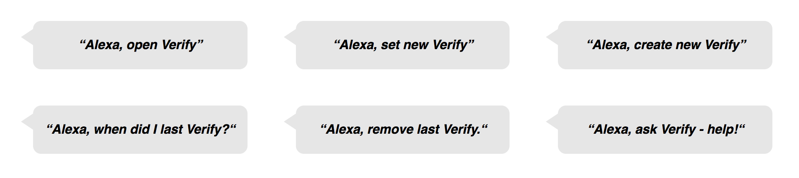

# Verify

## Background & Overview

[Verify](https://miriam-lau.github.io/Verify/) is an *Amazon Echo* application that utilizes voice driven technology to log a date and time, allowing users to verify their last log time. The app is designed to work as a reminder for daily tasks which may be easily forgotten.


## Features

- Verbally set a time stamp with *Verify*
- Voice requests for your last completed reminder
- Allow data to persist between instances
- Include custom *Amazon Key Event Instances*



## Project Design

A [proposal README](./docs/README.md) was created to outline the scope and goals of the project.

While the team originally anticipated *Python* would be used to manage the backend of the project, we quickly pivoted to *Node.js* due to better integration with *Amazon's DynamoDB* system.

## Technology

*Verify* was built on the *AWS* platform.

- [*Amazon Skill Kit*](https://developer.amazon.com/alexa-skills-kit) was used for voice management and user interaction. A collection of data strings were mapped to a specific lambda functions. Voice input from the user are cross-checked with the data strings, and upon match triggers the associated lambda function.

```
SetVerify set new verify
SetVerify create a new verify
SetVerify verify now
SetVerify log now
```

- [*AWS Lambda*](https://aws.amazon.com/lambda/) handled user and database interactions. After a data response from the user was matched to an utterance, a function is created to convert *Alexa*'s timestamp to the correct date and time format before writing to the database. This is necessary so when a user asks *Alexa* to retrieve a reminder, *Alexa* will respond with the customized format.

``` js
function timeStamp() {
let now = new Date().toLocaleString("en-US", {timeZone: "America/Los_Angeles"});
now = new Date(now)
let date = [ now.getMonth() + 1, now.getDate(), now.getFullYear() ];
let time = [ now.getHours(), now.getMinutes() ];
let suffix = ( time[0] < 12 ) ? "AM" : "PM";
time[0] = ( time[0] < 12 ) ? time[0] : time[0] - 12;
time[0] = time[0] || 12;

for ( let i = 1; i < 3; i++ ) {
if ( time[i] < 10 ) {
time[i] = "0" + time[i];
}
}
return date.join("/") + " " + time.join(":") + " " + suffix;
}
```
- [*Amazon DynamoDB*](https://aws.amazon.com/dynamodb/) is a *NoSQL* database allowing persistence of information for users between interactions.
- [*Node.js*](https://nodejs.org/en/) was the language of choice to manage the *AWS Lamdba* functionality and user flow.


## Future Implementation

- Allow users to define multiple types of reminders and retrieve each by name.
- Establish automated text reminders to be sent to the user's mobile device if a preset check-in time is not met.
