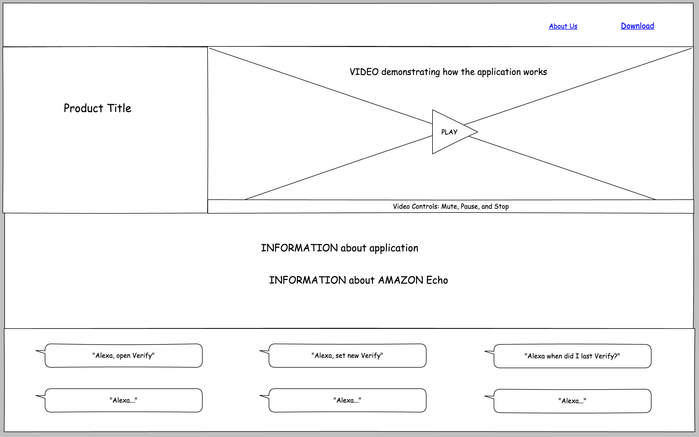
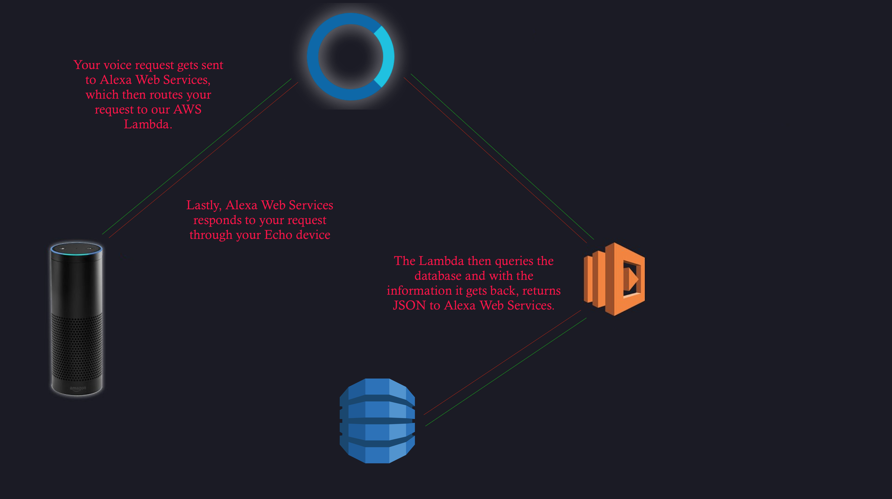

# Verify

## Background & Overview

Verify is an Amazon Echo application that utilizes voice detection technology.
Users can interact with Alexa to set a reminder as complete, to check if
the reminder has been completed, and to remove the reminder.   

## Functionality & MVP

Users will be able to:
- [ ] Utilize Alexa API
- [ ] Use voice recognition to create/remove reminders
- [ ] Use voice recognition to check if reminders are complete
- [ ] Use voice recognition to set reminders as complete
- [ ] Ask Alexa for help with using the application.
- [ ] View splash page which demonstrates the app

Bonus:
- [ ] Aggregate stats
- [ ] Text reminders
- [ ] Custom voice

## Wireframes

## Technologies & Technical Challenges

* Alexa API
* Python
* AWS
* Voice recognition
* DynamoDB
* Node.js

## Project Flowchart

## Accomplished over the Weekend

* Learn Alexa API
* Research Alexa emulation
* Learn Python (CodeAcademy, practice problems, Alexa tutorial)
* Compare Python versus Javascript for building application

## Group Members & Work Breakdown

### Day 1 & 2
* Review technologies as a team, solidify proficiency
* Review/revise work breakdown and flowchart

### Day 3
* Set up initial framework for application **TEAM**

### Day 4
* Set up voice recognition to create reminders **MIRIAM**
* Set up voice recognition to remove reminders **GARY**
* Set up voice recognition to check reminders **JON**
* Set up voice recognition to set reminders as complete **STEPHEN**

### Day 5
* Finalize and test **STEPHEN** **MIRIAM**
* Begin building splash page **GARY**
* Assess our emulator/video options **JON**

### Day 6
* Integrate emulator/video if needed **JON** **GARY**
* Launch app and website **STEPHEN** **MIRIAM**

### Day 7
* Launch testing **MIRIAM** **STEPHEN**
* Application testing **JON** **GARY**
