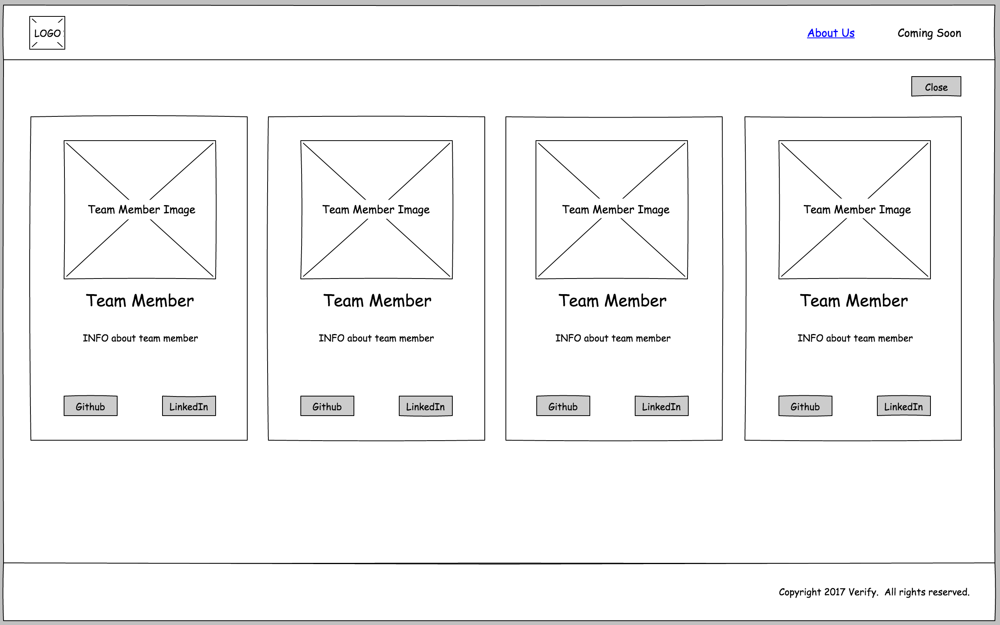

# Development of *Verify*

## Summary

*Verify* is an *Amazon Echo* application that utilizes voice detection technology.
Users can interact with *Alexa* to create a reminder, set a reminder as complete, to check if
the reminder has been completed, and to remove the reminder.   

## Functionality & MVP

Users will be able to:
- [ ] Utilize *Alexa* API
- [ ] Use voice recognition to create and remove reminders
- [ ] Use voice recognition to check if reminders are complete
- [ ] Use voice recognition to set reminders as complete
- [ ] Ask *Alexa* for help with using the application
- [ ] View splash page which demonstrates the app

Bonus:
- [ ] User can view stats on their reminders
- [ ] User will receive a text on their mobile device on incomplete reminders
- [ ] User can choose a custom voice to return messages instead of *Alexa*'s voice.

## Wireframes

## Technologies & Technical Challenges

* *Alexa* API
* *Python*
* *AWS*
* Voice recognition
* *DynamoDB*
* *Node.js*

## Project Flowchart

## Group Member Responsibilities & Implementation Timeline

### Day 1 & 2
* Learn *Alexa* API **(TEAM)**
* Research *Alexa* emulation **(TEAM)**
* Learn *Python* (*CodeAcademy*, practice problems, *Alexa* tutorial) **(TEAM)**
* Compare *Python* versus *Javascript* for building application **(TEAM)**

### Day 3 & 4
* Design website, create wireframe mockups, and obtain user feedback **(MIRIAM)**
* Review technologies as a team, solidify proficiency **(TEAM)**
* Review/revise work breakdown and flowchart **(TEAM)**
* Review and revise proposal **(MIRIAM** & **STEPHEN)**

### Day 5
* Set up initial framework for application **(TEAM)**

### Day 6
* Set up voice recognition to create reminders **(MIRIAM)**
* Set up voice recognition to remove reminders **(GARY)**
* Set up voice recognition to check reminders **(JON)**
* Set up voice recognition to set reminders as complete **(STEPHEN)**

### Day 7
* Finalize and test application **(STEPHEN** & **MIRIAM)**
* Begin building splash page **(GARY)**
* Assess our emulator/video options **(MIRIAM** & **JON)**

### Day 8
* Integrate emulator/video if needed **(JON** & **GARY)**
* Create "About Us" page and finish website **(MIRIAM)**
* Launch application and website **(STEPHEN** & **MIRIAM)**

### Day 9
* UI and UX testing for website **(MIRIAM** & **STEPHEN)**
* Application testing **(JON** & **GARY)**
* Complete production documents and README **(MIRIAM** & **STEPHEN)**
